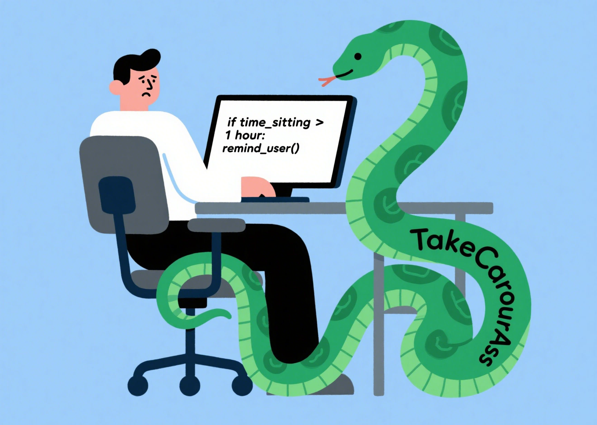
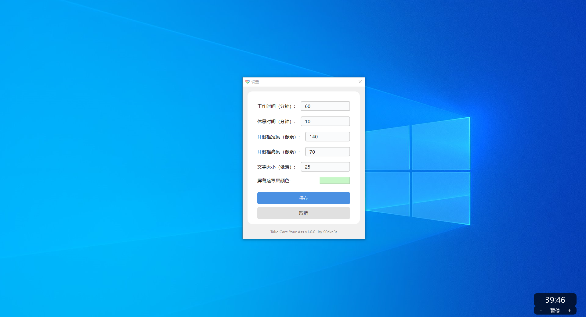

# Take Care Your Ass

你还在电脑前一坐就是一整天吗？小心你的屁股和健康！

本软件就是来“拯救你的屁股”的：它会定时提醒你站起来活动，强制你休息，防止你变成“久坐星人”。

> 医学研究表明，久坐不仅会导致肥胖、腰椎间盘突出、静脉血栓等问题，还会显著增加心血管疾病和早亡风险（参考：2012年《柳叶刀》久坐危害研究）。

别让你的椅子成为健康杀手，Take Care Your Ass！



## 主要功能

- 自定义工作时长和休息时长（只要大于1分钟即可）
- 自定义屏幕遮罩层颜色，休息时全屏覆盖，强制提醒
- 计时器窗口可自由拖动，自动记忆上次位置
- 计时器窗口可自定义大小、字体
- 支持一键暂停/继续、加减10分钟
- 支持最小化到系统托盘，托盘菜单可随时打开设置或退出
- 所有设置和窗口位置自动保存

## 安装环境要求

- Python 3.6 或更高版本
- PySide6
- PyYAML

## 安装与运行

1. 克隆或下载本仓库
2. 安装依赖：
   ```bash
   pip install -r requirements.txt
   ```
3. 运行程序：
   ```bash
   python main.py
   ```


## 默认设置

- 工作时间：60分钟
- 休息时间：10分钟
- 计时框大小：140x70
- 文字大小：25px
- 屏幕遮罩颜色：淡黄绿色
- 计时器初始位置：屏幕右下角

## 注意事项

- 关闭设置窗口不会退出程序，程序会继续在系统托盘中运行
- 只有通过系统托盘菜单的“退出”选项才能完全退出程序
- 程序会自动保存最后的设置和计时器位置
- 休息时会全屏强制遮罩，需等待或按ESC结束

## 打包为可执行文件

### Windows
1. 确保已安装 pyinstaller：
   ```bash
   pip install pyinstaller
   ```
2. 运行打包脚本：
   ```bash
   ./build_exe_win.bat
   ```
3. 打包完成后，`dist` 目录下会生成 `TakeCareYourAss.exe`。

### Linux
1. 确保已安装 pyinstaller：
   ```bash
   pip install pyinstaller
   ```
2. 赋予脚本执行权限并运行：
   ```bash
   chmod +x build_exe_linux.sh
   ./build_exe_linux.sh
   ```
3. 打包完成后，`dist` 目录下会生成 `TakeCareYourAss` 可执行文件。


## 开源与贡献

欢迎提出建议或提交PR，让更多人“保护屁股，远离久坐危害”！ 